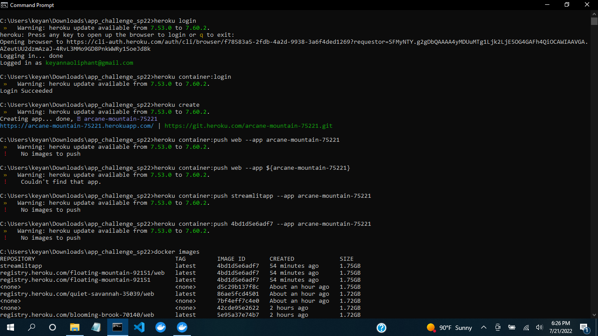
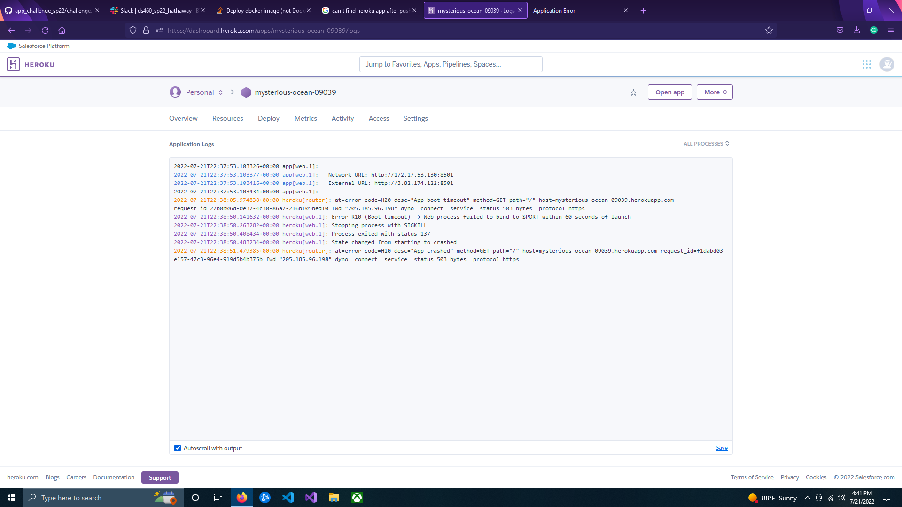

## Note
At this point I don't think I'm going to be able to get the app to display in Heroku. I've tried everything I could think of and it's still not working and you know what, I'm ok with it. Everything else is/was working beautifully and I'm very tired and burnt out after spending 4+ hours just trying to get Heroku to work. I will post screenshots of what was going on with my Heroku app below to give a better illustration of what was going on.
## Links
* [Repository Link](https://github.com/mon154/app_challenge_sp22)
* [Streamlit Link](https://mon154-app-challenge-sp22-main-streamlit-wt3s9u.streamlitapp.com/) -->

## Heroku Issues
After following the instructions in the Creating a Streamlet web app, building with Docker.... site and trying to build the image that way, I ran into major issues with Building and Pushing the image to the container as you can see here.

The only way I ever got it to push was by tagging the docker image to the Heroku app address and then pushing the registry to Heroku but when I did that my app wouldn't start correctly as seen here in the Heroku Logs. I'm assuming that's because I'm not supposed to be tagging the image to push it but I couldn't get push working at all.

 
However, I was able to sucessfully run streamlit out of the Docker container before changing the Dockerfile to push to Heroku.
 
## Vocab Questions
### Value of Databricks:
Databricks is great because you have the ability to have shared collaborative pages between groups that is stored on the cloud which removes the hassle of syncronizing coding spaces between computers. Also it provides easy access to pyspark which is incredibly helpful when working with datasets, especially large ones as databricks is a web-based platform so it is not limited by how much storage space is on your personal computer.
### Pyspark Vs Pandas:
I personally really enjoyed Pyspark as it can do practically everything pandas can but also can manipulate the code in a way that is similar to SQL which makes it more intuitive to learn for people already familar with SQL. In addition, it's also capable of working with significantly larger datasets which is something Pandas struggles with.
### Docker Explanation:
I've come to think of Docker as a baby virtual machine that you can share between computers. In a docker container, I can store my code and also all the dependancies needed to run it, such as libraries or tools. After that someone who wants to run or test my code can run my docker container without having those libraries installed on their computer. That way we can pass along code easily without fear of computer setup causing issues with the code, such as having a different version of python or other related issues.
### Statistical Regression vs Machine Learning regression:
The difference seems to be the difference in philosophy between statistics and machine learning in general. Statistical modeling is focused on finding relationships between variables and the significance of them while Machine learning is focused on regression solely for the purpose of making a prediction based on the model.